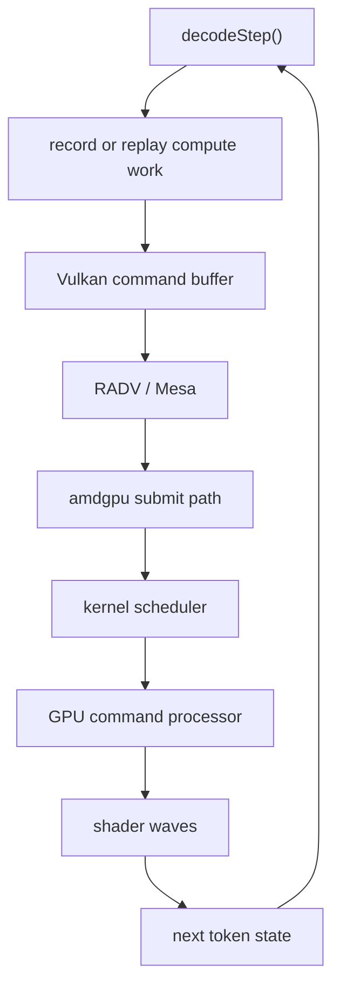

We did not start ZINC_RT because Vulkan failed.

We started it because Vulkan worked.

That distinction matters. Vulkan got ZINC to the first serious milestone: an inference engine we could run on AMD hardware without asking users to install ROCm, without narrowing the project to datacenter GPUs, and without pretending local inference only matters on one vendor stack. It let us build real kernels, load real GGUF models, run real Qwen prompts, and compare against llama.cpp on the same Radeon AI PRO R9700 node.

It also made the next problem impossible to ignore.

Once the kernels got fast enough, the shape of the runtime started showing through the profile. Not one shader. Not one missing fused op. The whole submission model. The layers of generality between "I need the next token" and "the command processor should run this tiny graph again, with these addresses and this position."

ZINC_RT is what happens when an inference engine earns the right to question its runtime.

## Vulkan was the right first answer

The first job was not to build a new GPU runtime. The first job was to prove that the model path was worth optimizing at all.

Vulkan was the right answer for that phase because it gave us three things that mattered more than elegance:

| Requirement | Why it mattered |
| --- | --- |
| Runs on AMD consumer and workstation cards | Local inference should not require a datacenter software stack. |
| Exposes compute, memory, descriptors, barriers, and queues | We needed real control, not a black-box inference framework. |
| Has a mature driver path through Mesa/RADV | We could compare against llama.cpp and move quickly. |

That got us to the version of ZINC people can run today. The current Vulkan backend is not a toy. On the published RDNA4 benchmark suite, ZINC reached 117.07 tok/s decode on Qwen3.6-35B-A3B UD Q4_K_XL, ahead of llama.cpp at 104.47 tok/s on the same card and model. Prefill still lags, 88.08 tok/s for ZINC versus 181.95 tok/s for llama.cpp, which is exactly why the work is not finished.

But decode is where the runtime question became sharp.

Token generation is a strange workload. It is not a single giant matrix multiply. It is a long chain of small and medium operations with hard ordering constraints, tiny pieces of CPU-visible state, routing decisions, recurrent SSM state, KV cache updates, and one brutal fact: all of it has to happen again for the next token.

Vulkan can express that. It cannot make it feel native.

## The ceiling moved

Early in a backend, everything is obviously bad. The embedding path is on the CPU. A shader is scalar where it should vectorize. A quantized matmul is reading memory in the wrong order. A barrier is too broad. A temporary buffer is too large. These are satisfying bugs because they have names.

After enough cycles, the easy names disappear.

The remaining cost starts to look like this:



Every layer exists for a reason. Vulkan needs to be portable. RADV needs to serve many applications, not just autoregressive decoders. The kernel scheduler has to be safe and fair. None of that is wrong.

It is just not shaped like one model, one GPU, one hot decode loop, replayed thousands of times with tiny changes.

For LLM inference, the ideal runtime looks less like a graphics API and more like a specialized conveyor:

| Part of the decode loop | General API view | ZINC_RT view |
| --- | --- | --- |
| Work submission | Submit command buffers through a portable driver stack | Keep a model-specific queue hot and feed it exactly the packets it needs. |
| Graph changes | Rebind descriptors, constants, and dispatches through API objects | Patch a compact command stream for token position, buffers, and routing. |
| Scheduling | Let a general runtime arbitrate each unit of work | Own request scheduling, batching, and decode pacing at the inference layer. |
| Persistence | Launch kernels repeatedly | Move toward persistent GPU-side loops where that is profitable. |
| Debugging | Observe through API and driver behavior | Instrument the runtime around tokens, fences, queues, and model events. |

That is the reason ZINC_RT exists.

Not because Vulkan is bad. Because Vulkan is a universal tool, and token generation is no longer asking a universal question.

## ZINC_RT is not a driver

The phrase "direct runtime" can sound more dramatic than it is.

ZINC_RT is not a new kernel driver. It is not a ROCm fork. It is not a plan to make users boot a custom kernel so a chatbot can be slightly faster.

The goal is narrower and more useful: build a ZINC-owned runtime layer for AMD GPUs that sits below Vulkan as an inference backend, while still using the normal Linux amdgpu stack. The runtime should know what ZINC knows: model topology, token cadence, KV cache layout, MoE routing, SSM state, buffer lifetime, and what actually changes from one token to the next.

That knowledge is the whole point. Vulkan cannot assume it. ZINC_RT can.

The current design has tiers because this has to be built without lying to ourselves:

| Tier | Purpose |
| --- | --- |
| T-CPU | Coherent fallback and correctness oracle. It runs the model path without pretending to be fast. |
| T1 KFD | Use AMD KFD queues and PM4 packets for direct submission through the existing kernel path. |
| T2 UMQ | Use user-mode queues where the kernel and hardware expose them. |
| Later persistent paths | Keep more of decode resident on the GPU and reduce per-token host work. |

That first tier is deliberately unglamorous. It is there so every later tier has something to prove against. A direct queue that is fast but wrong is a demo. A direct queue that matches the CPU-backed path token for token is a backend.

## The honest current state

As of this week, ZINC_RT is not the faster backend.

The coherent path runs, but the numbers make the situation obvious: the loop is seeing roughly 21 tok/s for `zinc_rt` versus about 116 tok/s for the Vulkan backend on the same validated RDNA4 benchmark. That is not a mysterious 18 percent runtime. It is the T-CPU path doing what it was meant to do: keep the model behavior coherent while the direct submission path is brought up underneath it.

The useful part is what the bring-up has already told us.

KFD queue creation and destruction work on the node. That means the first direct path is real enough to keep pursuing. UMQ is not currently available there, with the kernel exposing `user_queue=-1`, so treating UMQ as the next blocking milestone would waste cycles. The next concrete step is simpler and more valuable: make the KFD path ring the doorbell, submit a tiny PM4 packet stream, and retire a fence.

That sounds small because it is supposed to be small.

Runtime work becomes dangerous when it skips the boring proof points. A queue exists. A packet is visible. A doorbell advances. A fence retires. A no-op submission works. Then a copy. Then a trivial compute dispatch. Then one ZINC kernel. Then a token. Then a graph.

That ladder is the project.

## Why this was worth starting now

The timing is the unusual part.

Most projects start a custom runtime too early. They hit one abstraction they dislike, blame the API, and disappear into infrastructure before the model even works. ZINC did the opposite. We used Vulkan until the kernels, loader, tokenizer, graph, MoE path, SSM path, KV cache, and benchmark harness were concrete enough that the runtime problem had a measurable shape.

That changes the question from "could a direct runtime be faster?" to "which costs are now outside the kernels, and can a direct runtime remove them without breaking the model?"

This is why ZINC_RT is exciting. It is not speculative architecture astronautics. It is a response to a profile.

There are specific things we want from it:

1. Fewer useless submissions per token.
2. Cheaper graph replay for a mostly-static decode graph.
3. Better ownership of request scheduling and continuous batching.
4. A memory plan that matches the model instead of the API object model.
5. A path toward persistent decode work on the GPU.
6. A runtime that can be instrumented in model language: tokens, layers, experts, cache pages, fences.

The internal milestones reflect that. M1 is not "beat Vulkan by magic." M1 is the first real direct-submission decode path, with an early target around 140 tok/s. Later milestones push toward deeper graph specialization and persistent execution. The numbers are targets, not claims. The point of publishing them is to make the bet falsifiable.

If ZINC_RT cannot beat Vulkan after it owns submission, scheduling, and graph replay, then we will have learned something real. If it can, then local LLM inference gets a backend designed for the workload instead of adapted to it.

## Vulkan stays

One important design constraint: Vulkan does not go away.

That would be the wrong lesson. Vulkan is why ZINC has a portable AMD backend at all. It is the stable path, the reference path, and the backend most users should expect to run for a while. ZINC_RT has to earn its place by passing the same tests, running the same models, and beating the same benchmark harness.

The useful future is not a rewrite where the old backend gets deleted. It is a runtime stack with levels:

```text
ZINC model/runtime layer
  |-- Vulkan backend: portable, mature, production path
  |-- ZINC_RT backend: direct AMD path for lower overhead decode
  |-- Metal backend: Apple Silicon path
```

That gives the project a way to stay practical while still asking harder questions. Users get the path that works. The runtime work gets measured against something real. The codebase keeps a reference implementation when the direct path is wrong.

## The real reason

The real reason we started ZINC_RT is that local inference should not stop at "the kernels are okay."

A model runtime is not just a bag of shaders. It is a scheduler, a memory manager, a queueing system, a graph executor, a tokenizer boundary, a cache policy, and a set of latency promises. Once the shader layer is no longer the only obvious bottleneck, owning the runtime becomes the next form of optimization.

Vulkan helped ZINC get fast enough to see that.

ZINC_RT is the next experiment: can a local LLM engine own enough of the path from token to command processor that AMD inference stops paying for abstractions it no longer needs?

That is the bet. Not a new driver. Not a new framework. Not a victory lap.

A runtime built from the decode loop outward.
