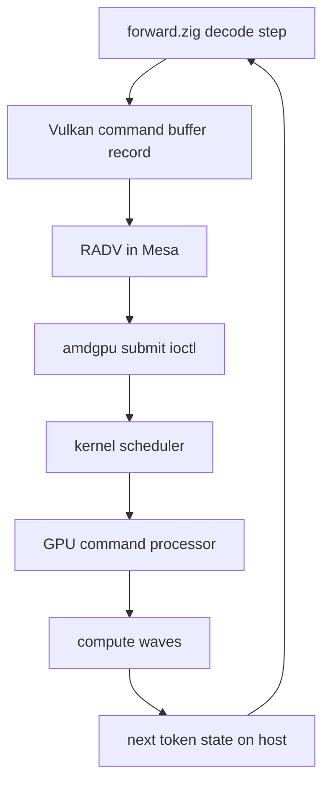

We hit 117 tok/s decode on Qwen3.6-35B-A3B on a Radeon AI PRO R9700 through ZINC's Vulkan backend. llama.cpp on the same card and same model sits at 104. That is the part that looks like a win.

The part that does not look like a win is the bandwidth utilization. 117 tok/s is 31 percent of the R9700's 576 GB/s of DRAM throughput. The remaining two-thirds is not hidden inside any single shader. It is sitting in the runtime layer above the shaders, and the runtime we are using is Vulkan, which was designed to keep a 144 Hz game running with a swapchain and a thousand draw calls. None of that is shaped like one decode loop replayed thousands of times for the next token.

For AMD consumer GPU inference today, there are exactly three real choices. Vulkan through Mesa RADV. ROCm with HIP. Or write your own. We picked the third option, kept the first one in tree as a permanent peer, and explicitly rejected the second. This post is the long version of that decision, with the numbers we used to make it.

## The three AMD GPU runtimes, side by side

Before the deep dive on each, here is the comparison the rest of the post supports.

| Surface | ROCm + HIP | Vulkan + RADV | ZINC_RT |
| --- | --- | --- | --- |
| Layer | Userspace runtime + drivers | Userspace graphics-and-compute API | Userspace inference runtime |
| Kernel side | `amdgpu` plus ROCk modules | `amdgpu` | `amdgpu` only, no extra modules |
| Userspace size | About 600 MB on disk | A few MB plus Mesa | Single Zig binary |
| Default on consumer AMD Linux? | No, opt-in install | Yes, ships with the distro | Built into ZINC |
| Compiler | LLVM HIP plus HSAIL | `glslc` to SPIR-V then ACO to PM4 | Our IR to PM4 directly, hand-tuned ISA at M4 |
| Submission cost per call | Tens of microseconds via HSA queues | About 33 µs `vkQueueSubmit` + fence on RADV | About 200 ns ring write plus doorbell |
| Multitenant batching | External (vLLM, sidecars) | Not in the API | Native, in the engine |
| Persistent kernel support | HIP Graphs, no persistent control on RDNA4 | None | M5 megakernel target |
| Consumer RDNA4 maturity | Late, fragile, often missing | Mature, broadly used, our current production path | Bring-up, M0 in tree |
| What it is good at | NVIDIA-shaped datacenter workflows | Portable, mature, ships everywhere | One model, one GPU, one decode loop |

This table is the post in one frame. Vulkan is winning today because it is mature and present. ROCm is not winning on consumer AMD because the assumptions ROCm makes about how a user got their stack installed do not match the consumer reality. ZINC_RT is not winning yet because it is M0. But the long-term reason to write it lives in the bottom three rows: multitenant batching, persistent kernels, and a runtime that knows it is running LLM inference rather than treating the workload as generic compute.

## What Vulkan plus RADV actually does on the decode hot path

A Vulkan decode step on ZINC routes through this stack.



Every box exists for a reason. RADV serves every Vulkan application on the system, not just ZINC. The amdgpu submit path has to be safe across processes. The Vulkan API itself was designed for portability across vendors and across draw-heavy graphics workloads. Reading the diagram top to bottom, the only box that is shaped specifically for ZINC is the first one. Everything below it is a generality tax.

Where exactly does the time go on this stack? The dispatch itself is fast. A single PM4 `DISPATCH_DIRECT` takes about 0.016 microseconds GPU-side and 0.057 microseconds wall-clock. The expensive parts of Vulkan are the parts in between.

`vkQueueSubmit` plus `vkWaitForFences` is about 33 microseconds on RADV. A decode token submits 1 to 4 of those on the fast path and up to 25 to 50 on paths that need MoE router or top-k readback. Re-recording a command buffer for a roughly 1500-node decode graph takes about 80 microseconds, which is a problem the second continuous batching arrives because every joining or leaving request changes the graph shape. `vkUpdateDescriptorSets` runs on every dispatch on devices without `VK_KHR_push_descriptor`. Descriptor pools have to be reset every frame. The `VkInstance` plus validation-layer cold start is around 30 ms on first run.

Then there is the shader toolchain. We documented a 5x performance cliff on the same shader when we tried newer `glslc`. On shaderc 2023.8 a representative workload runs at about 110 tok/s. The same code through shaderc 2026.2-dev drops to 19 to 25 tok/s. The cause is upstream `glslc` emitting SPIR-V that RADV's ACO compiler optimizes worse than the older output, not a regression in our code. We pinned the Ubuntu 24.04 shaderc 2023.8 package as a hard install requirement to recover the performance, and that experience is exactly the kind of fragility we want to leave behind.

Outside the API itself, the stack has firmware-shaped landmines too. Turning off ECC on the R9700 gives 9 percent more decode tok/s on Qwen35B, taking the same code from 101 to 110. The bench node has to stay on a Mesa version that is not too new, because Mesa 25.2.8 introduces a 14 percent RADV regression we cannot patch from userspace. Kernel 6.17 clamps the GPU clock to 2200 MHz when older kernels allowed 2350 MHz. None of these are Vulkan's fault. They are what owning the runtime through a graphics API gets you. You inherit every decision of every layer underneath, and a regression three layers down is yours to work around.

Vulkan is still the right place to be today. It is mature, it is in CI, it runs faster than llama.cpp on the same hardware, and it does not need a separate driver install. None of that is changing. But the path from 117 to 240 tok/s does not go through `vkQueueSubmit`.

## What ROCm with HIP would have given us, and why we did not take it

ROCm is the closest analog to CUDA on AMD. The userspace stack has a HIP runtime, the HSA Runtime, math libraries (rocBLAS, MIOpen, hipBLASLt), and the Composable Kernel templates that the upstream inference engines build against. On a supported card with a supported kernel, ROCm 7.0 will run gfx1201 RDNA4 just fine, and on datacenter MI300X parts it is the right answer.

For consumer RDNA4 boxes, the calculus is different.

The first issue is install weight. ROCm 7 occupies about 600 MB of disk before any application links against it, and the HIP runtime brings a C++ build dependency the rest of ZINC does not need. ZINC is one Zig binary that loads a GGUF and serves HTTP. Adding 600 MB of libraries and a C++ toolchain to get an alternative submission path is a non-trivial cost we would have to amortize against a measurable win.

The second issue is consumer-card history. ROCm support for the Radeon RX 9070 family on day one was incomplete, the ROCk kernel modules historically diverged from upstream amdgpu, and Mesa RADV has been the more compatible and often faster path on consumer Radeons for years. Our own tuning documentation reflects this. Every measurement we have made on the bench node uses RADV. None uses ROCm. That is not an oversight. That is what the consumer software stack looks like in practice.

The third issue is the persistent-kernel target. The long-term ZINC_RT plan ends at a megakernel that holds the GPU for the duration of a serving session. HIP Graphs functionally match CUDA Graphs but, on RDNA4 today, do not expose the persistent-kernel control surface that the Hazy Research Llama-1B megakernel relies on. We would be writing ZINC_RT-shaped code anyway, except wrapping HIP would mean staying inside the abstraction and hoping it grows the features we need on the right timeline.

The fourth issue is identity. The ZINC README's no-ROCm and no-MLX promise is a deliberate position about what local inference should look like on consumer hardware. A user who buys a Radeon RX 9070 should be able to clone the repo, run `zig build`, and serve Qwen3 within minutes. Asking that user to install ROCm first contradicts the point of the project.

ROCm is the right answer on H100-shaped infrastructure where someone else maintains the userspace stack. It is not the right answer for one Zig binary that runs on the box under the user's desk. That decision has been load-bearing since the project started.

## What ZINC_RT is, layer by layer

ZINC_RT is a userspace runtime, in the same OS-level category as the CUDA Runtime, ROCm's HSA Runtime, or Vulkan itself. The kernel driver under it stays exactly the same. On Linux it is amdgpu. On macOS it is Metal sitting on the IOKit stack. ZINC_RT does not replace either.

The pieces we own end to end are these. A submission ring per supported tier. A transformer-shaped intermediate representation with opcodes like `RMS_NORM_FUSED_QKV`, `MOE_GATE_TOPK`, `SSM_DELTA_NET`, and `FLASH_ATTN_BATCHED`, not `MATMUL` and `ADD`. A kernel ABI with our own 64-byte header and our own assembler tooling. A memory plan that consolidates one big buffer object per layer-class so the L2 prefetcher does its job across layers. A scheduler that runs continuous batching and tenant-aware admission inside the engine, with no Python and no sidecar.

The tier list keeps this honest.

| Tier | Path to the GPU | Current status |
| --- | --- | --- |
| T-CPU | Pure Zig reference, no GPU | Bring-up oracle, runs on a laptop, M0 |
| T1 KFD | PM4 packets directly over `/dev/kfd`, the tinygrad path | Scaffolding in tree, smoke dispatch verified on R9700 |
| T2 UMQ | AMDGPU user-mode queues on kernel 6.16+ | Bench node does not yet expose it, T1 takes precedence |
| T-Metal | Reuses existing Metal kernels under the new IR | Scheduled for M2 |
| T-Intel | i915 or xe doorbell submission on Arc Xe2+ | M7 |
| T-CUDA | CUDA Driver API plus CUDA Graphs | M8 |

T-CPU is the unglamorous part that makes everything else safe. Every other tier is bit-checked against it in CI. A T1 dispatch that disagrees with T-CPU is wrong by definition. New opcodes light up on T-CPU first, the contract is locked, and only then does any GPU code get written.

On the submission side, the contrast with Vulkan is sharp. A T1 submit is a `memcpy` of about 30 KB into a user-mapped ring buffer, followed by a single 64-bit MMIO store to the doorbell. Total latency from CPU call to the GPU's command processor reading the first packet is around 150 to 500 nanoseconds on RDNA4. That is 100x faster than `vkQueueSubmit` plus a fence wait. At M5 the megakernel removes submissions entirely. The CPU communicates with the resident kernel by writing to a BAR-mapped input ring and reading from a BAR-mapped output ring. No fences, no ioctls, no system calls in the steady-state hot loop.

## The multitenant batching argument is what makes this worth building

If the only thing ZINC_RT did was raise single-stream decode from 117 to 240 tok/s, it would not be worth the cost of a parallel backend. The reason to do this is the multitenant continuous batching architecture that lives one layer above the submission ring.

ZINC's actual deployment shape is a chat UI, an OpenAI-compatible API, an agent runtime, and an occasional batch eval, all on one consumer GPU. The interactive chat tenant needs first-token latency under 100 ms. The overnight batch job can wait minutes. The agent shares a long system prompt across most of its tool-use calls. Treating that as one stream of decode tokens is the wrong shape for the actual workload, and pushing the tenant policy into a Python sidecar gives up the latency we are trying to win.

ZINC_RT's scheduler runs four-level admission directly in the engine.

```
Tenant       quotas, KV reservation, priority class
  Session    multi-turn conversation, prefix-shared KV
    Request  one user turn
      Slot   GPU-side execution context
```

A tenant declares maximum concurrent slots, maximum KV pages, a tokens-per-second rate limit, and one of three QoS classes. Interactive is never preempted. Standard is preempted only by interactive. Batch is preempted by either. Admission uses dominant-resource fairness across `{slots, KV pages, decode token rate}`. New requests go to the tenant with the lowest dominant share. Eviction reverses the rule.

The mechanism that makes throughput-fair batching work is mixed prefill plus decode in one step. Each step has a flat list of `(slot_id, position)` query tokens, capped by a chunk budget that defaults to 8192 tokens on R9700. Decode slots are always packed first because they hold the interactive latency budget. Prefill is chunked dynamically. A 128k-token prompt becomes sixteen 8k-token chunks, interleaved with decode tokens on later steps. The flash attention kernel reads each query's slot and position directly, so there is no padding and no bucketing. vLLM does the same general thing now, but pays a CUDA-Graph rebuild whenever the prefill chunk count changes. ZINC_RT does not, because the IR shape is fixed at the chunk cap and only data changes.

| Concurrent slots | Vulkan today | ZINC_RT M3 | ZINC_RT M5 |
| ---: | ---: | ---: | ---: |
| 1 | 117 | 195 | 240 |
| 4 | 432 linear | 760 | 960 |
| 16 | OOM | 2 100 | 2 800 |
| 64 | OOM | 5 800 | 7 800 |

Aggregate decode tok/s on Qwen3.6-35B-A3B. The interesting column is M3. The Vulkan backend cannot reach sixteen concurrent slots at all without paged KV v2, and even with paged KV the per-slot re-record cost on every joining request would dominate. Per-tenant KV reservation partitions the page pool into a reserved per-tenant slice, a shared prefix-cache slice for tenants in the same isolation group, and a floating pool that bursts under quota.

This is the answer to the question of why a runtime and not just better shaders. The shaders are within 30 percent of bandwidth saturation. The batching, scheduling, isolation, and prefix-cache surface is where the local-inference engines outside the FAANG bubble are still rebuilding their own scheduler proxies in Python. We would rather build it once, in Zig, in the engine.

## The five Vulkan costs that compound

To make the comparison concrete, here is what each Vulkan surface costs on the decode hot path.

| Surface | Cost on RADV today | What ZINC_RT replaces it with |
| --- | --- | --- |
| `vkQueueSubmit` plus fence | About 33 µs per round trip | Ring write plus doorbell, about 200 ns |
| Command-buffer re-record | About 80 µs per 1500-node graph | IR is shape-static, slot table is data |
| `vkUpdateDescriptorSets` | Hot path on devices without push descriptors | Logical-name buffer binding, resolved once |
| SPIR-V toolchain | 5x perf cliff between `glslc` versions | Hand-tuned ISA at M4 onward |
| Mesa upgrade exposure | 14 percent regression on Mesa 25.2.8 | Direct PM4 schema pinned per generation |

Each row is small in isolation. The point is they multiply when continuous batching arrives. A 16-slot serving deployment with bursty arrivals re-records the graph on every join, fence-waits on every dispatch, and updates descriptors per slot. The Vulkan API is doing exactly what it was designed to do. It was just not designed for this.

## The two-backend stance is permanent

We are not deleting Vulkan. The Vulkan backend stays in `src/vulkan` and `src/compute/forward.zig`. It is selected with `-Dbackend=vulkan`. It is tested in CI on every change. It is the well-trodden fallback when ZINC_RT regresses or lands on hardware without a direct tier. A cross-backend logit-equality test runs on every pull request, so a divergence between the two builds is a release blocker rather than a debugging mystery weeks later.

The cost of carrying both backends is real but modest. They share the GGUF parser, the tokenizer, the HTTP server, the model catalog, the chat UI, and the bench harness. Only the GPU dispatch and the kernel set differ. About fifteen percent of additional maintenance load in exchange for always having a working fallback when ZINC_RT regresses on a new kernel or a new card. That trade is worth it on consumer hardware where users replace neither the OS nor the driver between buying the card and running a chatbot.

The same argument applies one layer up. We did not write ZINC_RT to abandon Vulkan. We wrote it to stop asking Vulkan to be an inference runtime as well as a graphics API.

## The honest current state and what would falsify the bet

ZINC_RT is at M0 plus T1 KFD bring-up as of this week. The scaffolding lives in `src/zinc_rt/` and `src/compute/forward_zinc_rt.zig`. The benchmark autopilot can launch a hand-encoded gfx1201 wave on T1 that loads a value from a user-data scalar pair and stores it to a host-readable address, with the fence retiring cleanly and no ring reset. That is a small demo. It is also what every later tier proves itself against. A queue exists. A doorbell advances. A fence retires. A real wave executes a real store.

Single-token decode on T1 today is far below the Vulkan number. We say this clearly because the project's gating logic depends on it. The keep-or-revert gate on the autopilot loop requires at least 0.5 tok/s of measured improvement to keep a change. GPU bring-up work that does not move the per-token decode number does not stay merged. The recipes do. The learnings do. That is the cost of building a runtime on the same node that runs the user-facing benchmark.

The bet has explicit falsification points. If M1, single-submit decode on T2 UMQ, does not move single-stream decode from 117 to at least 140 tok/s, then the submission layer was not the bottleneck we thought it was. If M3, continuous batching plus paged KV v2, does not deliver at least 760 aggregate tok/s at four slots, then the scheduler we wrote was not better-shaped than a sidecar around vLLM would have been. If the cross-backend logit diff between Vulkan and ZINC_RT shows persistent divergence we cannot close, then the IR was the wrong abstraction.

We have published these targets exactly so they can be checked. The point of writing them down is that they can be wrong.

## What this changes for AMD consumer GPU inference

The story for AMD inference for the last five years has been a binary. Either install ROCm and join the datacenter software stack, or use llama.cpp through Vulkan and accept the ceiling that comes with a graphics API. The first option does not match the consumer reality. The second option is where ZINC has been, and it took us to 117 tok/s decode and 12 percent ahead of llama.cpp.

The third option is a workload-specific runtime that runs through the same `amdgpu` driver every consumer Linux user already has, in one Zig binary, with no ROCm install and no toolchain landmines. That is what ZINC_RT is. The decision to write it was not about disliking Vulkan. It was about the long arc of local inference moving past kernels into batching, multitenancy, paged KV reservation, and persistent execution. The runtime is the next thing worth owning.

If you want the formal version, the design document is in `docs/ZINC_RT_DESIGN.md`. The Vulkan backend stays in tree, the cross-backend tests stay in CI, and the M1 number is the next gate. We will publish the result either way.
