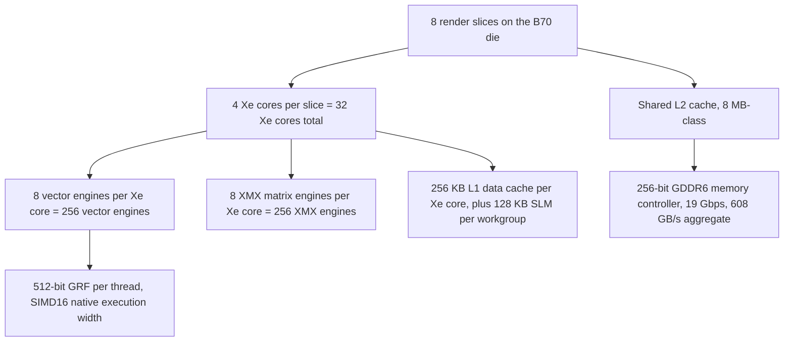

The Intel Arc Pro B70 puts 32 gigabytes of ECC GDDR6 on a 256-bit bus, 608 GB per second of memory bandwidth, 256 XMX matrix engines pushing 367 INT8 TOPS, 230 watts of board power, and PCIe 5.0 x16 onto a single workstation-class GPU at a price that sits much closer to the consumer-flagship band than to the traditional workstation band.

<figure class="diagram-card diagram-wide">
  
  <figcaption>The Intel Arc Pro B70: 32 GB ECC GDDR6, 608 GB/s on a 256-bit bus, 256 XMX engines, 230 W in a single-slot blower form factor. The full local-LLM spec triplet on one card at workstation MSRP.</figcaption>
</figure>

That spec sheet on a single card is what makes the Intel Arc Pro B70 worth a long technical look for anyone shipping local LLM inference. The 32 GB ECC tier of GPUs has historically meant NVIDIA RTX 5000 Ada at one price point or AMD Radeon AI PRO R9700 at another, both in the workstation price band that consumer buyers do not touch. The Intel Arc Pro B70 lands in the same VRAM and memory-bandwidth class as those cards while sitting much closer to consumer-flagship pricing, and that is the change that matters for local inference on 27B and 35B-parameter MoE models.

This post is the deep technical version of why the Intel Arc Pro B70 is the local LLM inference card to pay attention to right now. It covers what the Xe2 architecture inside the Intel Arc Pro B70 actually looks like, what DPAS does on the B70's XMX engines and how it compares to AMD's WMMA and NVIDIA's tensor cores, how the Arc Pro B70 fits into the full Intel Arc B-series lineup, what the bandwidth math says about peak achievable decode tok/s on Qwen3.6 35B-A3B running on the B70, and what ZINC's M7 T-Intel backend has to build to take advantage of the Intel Arc Pro B70.

## The Intel Arc Pro B70 headline number triplet

Three numbers do the work in this argument.

| Spec | Arc Pro B70 | Why it matters for local LLM inference |
| --- | ---: | --- |
| VRAM | 32 GB GDDR6 with ECC | Holds all of Qwen3.6 35B-A3B Q4_K weights, the activation scratchpads, and 50,000-plus tokens of paged KV in one card |
| Memory bandwidth | 608 GB/s (256-bit, 19 Gbps) | Decode is bandwidth-bound on dense and MoE models, and the decode ceiling on a 1.57 GB per token weight stream is about 380 tok/s at 100% BW utilization |
| Matrix throughput | 367 INT8 TOPS via 256 XMX engines | Enough headroom for prefill on long prompts and for the WMMA-class kernels that need wide tiles |

The B70 is not the fastest matrix-throughput card on the market and not the highest-bandwidth card on the market either. What it offers is the first combination of those three numbers at this price tier. Cards that match its 32 GB ECC capacity have historically required either much more power, a much higher MSRP, or both. Cards in the consumer Battlemage line (B580, B570) ship at much lower MSRPs but with 12 GB or 10 GB of VRAM, which puts a 35B-class MoE model out of reach.

## Inside the Intel Arc Pro B70: Xe2 architecture layer by layer

Intel's Xe2 is the Battlemage generation of the Xe family, and the Intel Arc Pro B70 is the inference-focused flagship implementation of it. The B70 die packages 32 Xe cores into 8 render slices.



Three things in this hierarchy matter for inference.

First, the SIMD execution width. Each vector engine operates on SIMD16 lanes natively. ZINC's existing Vulkan path on Intel uses this directly: the DMMV kernel in `src/compute/dmmv.zig` already has a SIMD16 specialization that matches the Xe2 subgroup width, sitting alongside the wave32 and wave64 specializations for RDNA. Code that assumes a fixed wave size is what fails to move between vendors. Code that lets the driver pick its native width and lowers from there does not.

Second, the XMX matrix engines. Each Xe core has 8 of them, one paired with each vector engine. They are systolic arrays that consume tiles and emit accumulated results without going back to the GRF on every cycle. The DPAS instruction is how a kernel hands work to them.

Third, the memory hierarchy. The 256 KB L1 per Xe core is generous, the 128 KB shared local memory per workgroup is comparable to RDNA's LDS, and the 256-bit GDDR6 bus at 19 Gbps gets you the 608 GB/s headline number. The L2 is shared across slices and acts as the working set for cross-Xe-core sharing, which matters for prefill where many cores read overlapping weight tiles.

## DPAS on the Intel Arc Pro B70: what the XMX matrix engines actually do

DPAS stands for Dot Product Accumulate Systolic. On the Intel Arc Pro B70's 256 XMX engines, it operates on small tiles whose shape the driver picks at runtime within a documented set. The canonical Xe2 tile is 8 by 8 by 16, meaning each invocation consumes an 8-element-by-16-element A operand, a 16-element-by-8-element B operand, and produces an 8-by-8 result accumulator. The supported operand types include INT8, BF16, and FP16, with FP32 accumulation in every case.

A DPAS instruction is therefore equivalent in scope to one WMMA instruction on RDNA4 (which uses a 16 by 16 by 16 wave32 tile) and one tensor-core instruction on NVIDIA Hopper (which uses a 16 by 16 by 16 wave32 tile). The differences are tile geometry, how A and B operands are laid out in registers, and what accumulator types are supported.

For ZINC's IR, that vendor variation lives below the opcode boundary. The opcode is `MATMUL_WMMA`. The lowering is per-tier:

| Tier | Matrix-engine instruction | Tile geometry |
| --- | --- | --- |
| T1 / T2 (RDNA4) | `v_wmma_*` | 16 by 16 by 16, wave32 |
| T-Metal (Apple Silicon) | `simdgroup_matrix` | Driver-dependent, typically 8 by 8 by 8 |
| T-Intel (Xe2) | DPAS | 8 by 8 by 16 typical, FP16/BF16/INT8 with FP32 accumulator |
| T-CUDA (Hopper) | `wmma` PTX intrinsics | 16 by 16 by 16, wave32 |

The IR sits above the geometry. The kernels are not.

## How the Intel Arc Pro B70 fits in the full Intel Arc B-series lineup

The Intel Arc Pro B70 is the inference-focused flagship of the B-series Pro line. The full Intel Arc B-series lineup is worth seeing in one place because the trade-offs across the family are not linear and the B70 is not always the right card for every shape of workload.

| Model | Xe cores | XMX engines | VRAM | Bandwidth | INT8 TOPS | TBP | Target |
| --- | ---: | ---: | --- | ---: | ---: | ---: | --- |
| **Arc Pro B70** | 32 | 256 | 32 GB ECC | 608 GB/s | 367 | 230 W | 32 GB inference flagship |
| Arc Pro B65 | 20 | 160 | 32 GB ECC | 608 GB/s | 197 | 200 W | Same VRAM and bandwidth, lower TOPS |
| Arc Pro B60 | 20 | 160 | 24 GB ECC | 456 GB/s | 197 | 200 W | Mid-tier 24 GB workstation |
| Arc Pro B50 | 16 | 128 | 16 GB ECC | 224 GB/s | 170 | 70 W | Low-power 16 GB, bandwidth-limited |
| Arc B580 | 20 | 160 | 12 GB | 456 GB/s | 233 | 190 W | Consumer flagship |
| Arc B570 | 18 | 144 | 10 GB | 380 GB/s | 203 | 150 W | Capacity-constrained consumer |

Two pairs in this table reward attention.

The Intel Arc Pro B70 and the Intel Arc Pro B65 share the same memory subsystem. Both ship 32 GB of ECC GDDR6 over a 256-bit bus at 608 GB/s. The difference is on the compute side, where the B70 has 1.6x the Xe cores and 1.86x the INT8 TOPS. For pure decode, which is memory-bandwidth-bound on most local-inference shapes, the B65 should reach within a few percent of the Arc Pro B70's tok/s on a per-card basis at lower TBP and lower MSRP. The Intel Arc Pro B70 separates itself on prefill and on speculative-decoding draft verification, both of which are matrix-throughput-bound.

The Intel Arc B580 and the Intel Arc Pro B70 are the closest comparison if you are choosing between consumer and workstation. The B580 is the better gaming card and ships at much lower MSRP. The Intel Arc Pro B70 is the only card in the table that holds the full Qwen3.6 35B-A3B working set with KV pages for sixteen concurrent slots, and the B580's 12 GB of VRAM is the constraint that decides the question for 27B and 35B models on the consumer line.

## Why the Intel Arc Pro B70's 32 GB of ECC VRAM changes the local-inference math

The reason the 32 GB tier matters is concrete. Qwen3.6 35B-A3B in Q4_K_XL needs approximately 21 GB of weights resident. The activation scratchpads for a single decode stream are around 1.5 to 2 GB. The paged KV cache for a 16-slot continuous-batching server at 8k context per slot is about 4 GB at 16-bit precision and 1 GB at Q8_0 KV.

A 24 GB card can serve one or two slots of 35B with a tight context budget. A 16 GB card cannot serve 35B at all. The Intel Arc Pro B70's 32 GB of VRAM can serve 16 concurrent slots of 35B at full context, with room for the prefix-cache pool that ZINC_RT's scheduler partitions out separately.

ECC matters because workstation deployments care about correctness over weeks of uptime. Bit flips in weight memory have caused incoherent generation on long-running self-hosted boxes, and the Intel Arc Pro B70's ECC enables RAM error-correction across the entire 32 GB of VRAM, not just the cache lines. RDNA4's R9700 also offers ECC. Most consumer cards do not.

## Bandwidth roofline: peak achievable tok/s on the Intel Arc Pro B70

For a model whose per-token decode reads `W` bytes of weights from DRAM, the maximum tok/s a memory-bandwidth-bound implementation can reach on a card with `B` bytes per second of memory bandwidth is `B / W`. For Qwen3.6 35B-A3B Q4_K_XL with about 1.57 GiB of weight traffic per decode token, the Intel Arc Pro B70's ceiling is:

```
tok/s_max = 608 GB/s / 1.57 GiB ≈ 380 tok/s at 100% bandwidth utilization
```

That is a ceiling, not a number anyone has measured on the Intel Arc Pro B70 yet. The current ZINC Vulkan backend on AMD's R9700 reaches 31% bandwidth utilization on the same model. At equivalent efficiency on the Intel Arc Pro B70 the projected number is around 117 tok/s, comparable to what ZINC measures on R9700 today. At ZINC_RT M5 megakernel efficiency targets (65% bandwidth utilization), the Intel Arc Pro B70 should clear 240 tok/s on single-stream decode and approach 2,800 aggregate tok/s at 16 concurrent slots, which is the same shape as the ZINC_RT scaling table for the R9700 because the two cards are within 6% on bandwidth.

The point is not that the Intel Arc Pro B70 is faster than the R9700. It is that the Intel Arc Pro B70 reaches the same class of performance at workstation MSRP that sits much closer to consumer pricing than the AMD or NVIDIA workstation alternatives at the 32 GB ECC tier.

## The Intel Arc Pro B70 MSRP argument, in three ratios

The argument for the Intel Arc Pro B70 as a game-changer at MSRP rests on three ratios, none of which require knowing the exact dollar number.

First, bandwidth per dollar at the 32 GB ECC tier. The cards historically holding this slot are positioned in the workstation price band where every NVIDIA RTX A-series and AMD Pro tier sits well above the consumer-flagship band. The Intel Arc Pro B70 is priced as a workstation card but in a range much closer to the consumer-flagship band. Per-GB/s of memory bandwidth at the 32 GB ECC tier, the Intel Arc Pro B70 is the lowest cost option on the table.

Second, VRAM per dollar at the inference-relevant tier. For 35B-class MoE models, 32 GB is the threshold where multi-slot serving becomes possible. The Intel Arc Pro B70 is the first card to put 32 GB of ECC VRAM at this price tier.

Third, power. 230 W is a single 8-pin connector card. It fits in standard workstation chassis and does not need exotic cooling. The NVIDIA RTX 5000 Ada at similar VRAM and bandwidth sits at higher TBP and needs more provisioning. For a self-hosted ZINC box under someone's desk or in a small server rack, 230 W is the right shape, and the Intel Arc Pro B70 hits it without sacrificing the bandwidth or VRAM headline numbers.

The result is that the Intel Arc Pro B70 is the first card where a small team running a chat UI, an OpenAI-compatible API, and a few agent runtimes off one self-hosted box can buy a 32 GB ECC card at a price that approximates what the consumer-flagship cards cost a year ago. Whether the consumer market notices is a different question. Whether ZINC notices is the topic of the rest of this post.

## Linux drivers for the Intel Arc Pro B70: i915 and xe

The Intel Arc Pro B70 needs either the i915 kernel driver or the newer xe driver to expose its compute paths to userspace. Both ship in modern Linux kernels, both are upstream, and both work on Xe2 Battlemage cards from kernel 6.10 onward. Mesa's ANV Vulkan implementation is the path most current AMD-and-Intel-compatible inference engines use to reach the card, and it supports `VK_KHR_cooperative_matrix` on Xe2 with DPAS-shaped tiles documented in the extension's tile-shape query.

What is not yet broadly exposed on Intel is the user-mode-queue equivalent of AMD's UMQ path. AMD's amdgpu driver gained UMQ on kernel 6.16 as the supported way to bypass per-submit ioctls. Intel's xe driver has a similar trajectory but the exact API surface and adoption status are moving targets. For ZINC's T-Intel design this means M7 lowers two paths: a doorbell-on-ring path equivalent to AMD's T2 UMQ when the i915 or xe driver exposes it, and a Vulkan fallback for cards or kernel versions where it does not.

Resizable BAR is mandatory for serious inference workloads on the Intel Arc Pro B70, not optional. Without resizable BAR, the host-to-device upload path stalls on every weight transfer, and BAR-mapped output rings, which ZINC_RT uses to read tokens from the GPU without a fence wait, cannot work. Every current distro defaults to resizable BAR on Xe2 cards. Verify in `lspci -vv | grep BAR` on a Intel Arc Pro B70 system before benching.

## ZINC's current Intel Arc Pro support in code

ZINC already classifies the Intel Arc Pro B70 and the rest of the Xe2 Battlemage family correctly. The detection lives in `src/vulkan/gpu_detect.zig`, which reads the Vulkan device properties on init and tags the device as `intel_arc_xe2` when the PCI vendor ID is Intel and the architecture matches Battlemage. This tag is what the DMMV dispatcher in `src/compute/dmmv.zig` uses to pick the SIMD16 specialization rather than the wave32 or wave64 path.

`VK_KHR_cooperative_matrix` is probed on init but not yet a hot path for prefill. The reason is that Intel's tile-shape exposure differs across driver versions, and the prefill kernel set has been the next thing on the queue rather than a thing already shipped. The Vulkan backend on Intel today runs the same DMMV-plus-subgroup-add path as the AMD backend, just with a different subgroup size. Decode works. Prefill works. Neither is yet tuned the way RDNA4 is.

ZINC has not yet published Intel Arc Pro B70 benchmark numbers in the perf suite. The closest things in tree are the GPU reference doc at `docs/INTEL_GPU_REFERENCE.md`, the model-and-bandwidth roofline math in the Xe2 section, and the gpu_detect.zig classification itself. Publishing measured Intel Arc Pro B70 tok/s numbers in the public benchmark is gated on adding an Intel Arc Pro B70 or B65 to the benchmark rotation.

## ZINC_RT M7: what T-Intel has to build for the Intel Arc Pro B70

The Intel Arc Pro B70 T-Intel plan is in `docs/ZINC_RT_DESIGN.md` §22.1 and §25.

Scope, in eight engineer-weeks:

- `src/zinc_rt/ring/i915.zig` (or `xe.zig`) — the doorbell-on-ring submission backend equivalent to RDNA's T2 UMQ. Same `submit`, `wait`, `map`, `alloc_bo`, `load_kernel` interface as every other tier. The packet stream is whatever the Xe2 command processor consumes natively.
- `src/zinc_rt/isa/xe2hpg/` — the kernel binary set for Xe2. Each opcode in the ZINC_RT IR (RMS_NORM_FUSED_QKV, FLASH_ATTN, MOE_GATE_TOPK, MATMUL_WMMA, and so on) gets one Xe2 kernel. The ABI is the same 64-byte header as on AMD with the GPU target field set to `xe2hpg`.
- The `MATMUL_WMMA` lowering for Xe2 maps to DPAS with the 8 by 8 by 16 tile. Q4_K-on-the-fly dequant into DPAS tiles is the same trick the RDNA4 kernel uses with WMMA. The lowering pass is per-tier; the IR is shared.
- BAR-mapped output ring on Xe2 to match the ZINC_RT M5 megakernel target later.

What does not need to be rebuilt:

- The IR. Vendor-neutral by design.
- The scheduler. ZINC_RT's continuous-batching scheduler is host-side Zig that does not care which tier is running underneath.
- The kernel ABI header. The same header works on every tier.
- The cross-backend validation. T-Intel outputs are bit-checked against T-CPU like every other tier.

Exit criterion at M7: Qwen3 8B decode at 50 tok/s or better on an Intel Arc B580 or Intel Arc Pro B70 via the T-Intel path, with the Vulkan backend on the same Intel Arc Pro B70 hardware continuing to pass CI. That number is the Intel Arc equivalent of M1's 140 tok/s gate on RDNA4: not the long-term ceiling, just the bar that proves the path works on the B70. The M3-equivalent number on the Intel Arc Pro B70 (continuous batching at 16 slots) is the multi-quarter target after M7.

Risk class: high. Two reasons. First, Xe2 PM4 equivalent documentation is thinner than AMD's PM4 reference, and the same is true of the i915 and xe user-mode submission APIs that T-Intel on the Intel Arc Pro B70 needs to drive. Second, DPAS optimization on the Intel Arc Pro B70 is less well-trodden than WMMA on RDNA4, and we are likely to spend cycles understanding the cooperative-matrix tile-shape query behavior on the B70 before we get clean kernels. Mitigation: the Vulkan path stays in CI on Intel Arc Pro B70 hardware throughout, and any T-Intel regression that does not measurably win the B70 benchmark gets reverted by the same gate that controls T1 and T2 on AMD.

## Why the Intel Arc Pro B70 path is worth building now

The reason T-Intel for the Intel Arc Pro B70 is M7 and not M2 is not about importance. It is about leverage. The ZINC_RT bring-up sequence on RDNA4 builds the IR, the scheduler, the paged KV layout, the megakernel, and the cross-backend validation. By the time M7 lands, every one of those pieces is shipped, debugged, and benchmarked on the harder vendor. The T-Intel work on the Intel Arc Pro B70 then reuses ~80% of the runtime, ships in 8 engineer-weeks, and lands on a card class where AMD does not yet have a direct competitor at this MSRP.

That timing also matches what the consumer market is doing. Intel shipped the Arc Pro B-series, including the Intel Arc Pro B70, at a price point that takes the 32 GB ECC tier from "for datacenter buyers" to "for self-hosted teams". The Intel Arc Pro B70 is on the market today. ZINC's job is to be the first inference engine that gives Intel Arc Pro B70 buyers a path to peak performance without ROCm, without HIP, without Triton, and without a Python sidecar.

## What T-Intel success on the Intel Arc Pro B70 looks like

When M7 closes, three things are true on an Intel Arc Pro B70 box.

The Intel Arc Pro B70 runs Qwen3 8B at 50 tok/s decode or better through `-Dbackend=zinc_rt` and through `-Dbackend=vulkan`, both passing CI on the same Intel Arc Pro B70 hardware, with the cross-backend logit-diff test green on every PR.

The Intel Arc Pro B70 hosts 16 concurrent slots of Qwen3.6 35B-A3B serving through the same ZINC_RT continuous-batching scheduler that runs on RDNA4, with per-tenant KV reservation, three QoS classes, and prefix-shared KV across tenant isolation groups. Aggregate tok/s at 16 slots on the Intel Arc Pro B70 is the multi-quarter follow-up target after the M7 exit gate.

The Intel Arc Pro B70 entry in the ZINC performance suite is the second non-AMD card with a peer-reviewed benchmark number, after Apple Silicon Metal. That entry is what tells a future buyer of an Intel Arc Pro B70 that ZINC is the option that closes the gap from "the Intel Arc Pro B70 can do this" to "the Intel Arc Pro B70 does do this".

## Where to read more about the Intel Arc Pro B70 path

The full ZINC_RT design including the T-Intel section for the Intel Arc Pro B70 is in `docs/ZINC_RT_DESIGN.md`. The Intel Xe2 architecture reference, including the per-SKU spec breakdown the Intel Arc Pro B70 table above is built from, is in `docs/INTEL_GPU_REFERENCE.md`. The companion post on the runtime decision itself, including the three-way ROCm versus Vulkan versus ZINC_RT analysis, is on this site at `/blog/inside-the-decision-to-write-our-own-gpu-runtime-for-local-llm-inference`.

The Intel Arc Pro B70 is the most interesting consumer-adjacent GPU launch for local LLM inference in the last year, not because the Intel Arc Pro B70 is the fastest card but because the Intel Arc Pro B70 is the first card that puts the 32 GB ECC plus 600-plus GB/s tier within reach of buyers who would never have considered a workstation GPU at last year's prices. ZINC's plan is to make the Intel Arc Pro B70 do what its spec sheet says it can do. M7 is when that plan becomes a benchmark number on the Intel Arc Pro B70.
